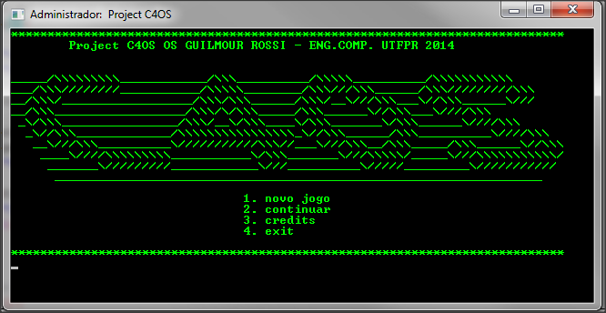

# c4os

c4os is a simple pure .c game to run in terminal built in 2013 on my first year at university.
# 

## 1. Sinopse do Jogo

 Uma antiga caixa com 50 unidades de disquetes 3½'' não parece algo muito interessante aos adolescentes nos dias de hoje. A não ser para Léo, um jovem estudante de Engenharia de Computação, que à encontra num canto empoeirado no arquivo da biblioteca central de sua universidade. Letras miúdas rabiscadas na caixa o chamaram à atenção: “Better than change the world, is create a new one.” seguidos de dois brasões, que ele reconheceu serem do MIT e da Harvard University. Em sua antiga máquina, um PC com processador AMD K7, Léo testa os discos. E após inseri-los um por um acompanhando uma barra de carregamento, que mesmo com alguns avisos de arquivos corrompidos, solicitou para que prosseguissem com a inserção do disquete intitulado “ca4os laucher”, Léo começa a ler algumas documentações do complexo software, que acabará de encher seu monitor. Longos textos com tópicos como infinitos, buracos-negro, universos paralelos, lei de relatividade e outros tão interessantes e complexos quanto, vão surgindo entre os arquivos. Léo pensou ser apenas um simulador universitário, junto com coletânea de bons textos e livros, até que se deparou com um arquivo de log relatando o quanto do software ainda precisava ser codificado e que, seu objetivo “Criar um universo a partir da energia negativa do campo gravitacional” estava a poucos passos de se tornar realidade. Léo agora se vê num grande desafio, numa tentativa de terminar de codificar o software e remontar dados perdidos, terá de usar seus conhecimentos e tecnologias atuais, a fim de dar um grande passo na ciência e quem sabe, 'brincar de deus'. 

